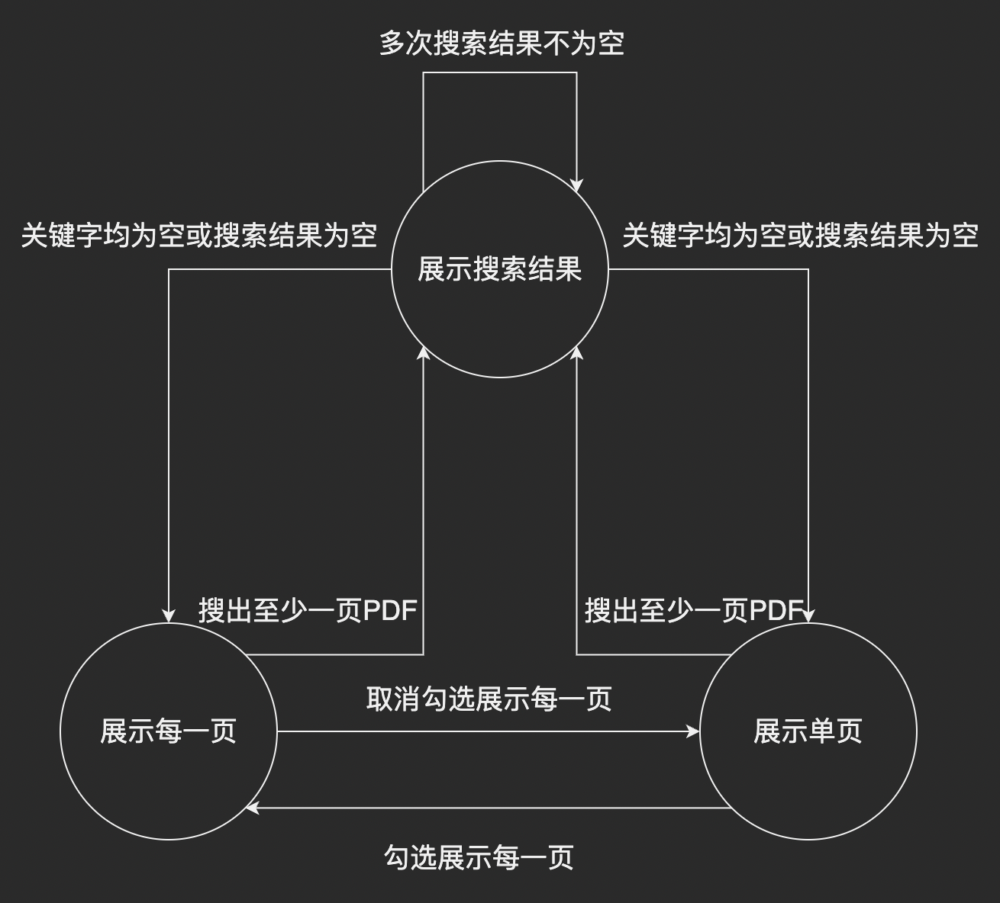

# file-encrypt
> 文件加密解密：文件明文不会出现在磁盘中。

## Project setup
```bash
yarn install
```

### Compiles and hot-reloads for development
```bash
yarn serve
```

### Compiles and minifies for production
```bash
yarn build
```

### Run your unit tests
```bash
yarn test:unit
```

### Lints and fixes files
```bash
yarn lint
```

### Customize configuration
See [Configuration Reference](https://cli.vuejs.org/config/).

## 引言
我们偶尔会希望某些文件仅在查看时才解密，而明文数据总是不出现在硬盘中，类似于加壳的可执行文件。另外，我们偶尔会希望能够在浏览器预览解密所得数据。为了实现这些需求，我能想到的技术栈有：前端、pyqt5（python）、qt（cpp）。我最熟悉前端技术栈，而且后两者的工作量看上去太大了，所以这个demo选择用前端技术栈实现。但在开发的过程中，我逐渐感受到前端技术栈的玩法比我想象得更多。

本文仅简单讲述实现上的注意点，其余细节佬们可查看代码，[GitHub传送门](https://github.com/Hans774882968/file-encrypt)。

由于时间紧迫，样式等方面都没有经过设计，让佬们见笑了～

技术栈：
- 使用`vue-cli`创建项目。vue3.2 setup语法糖、webpack、jest、cypress。
- 用babel创建AST，进行JS代码处理。

### TLDR
1. 浏览器端使用原生JS已经可以进行任意文件处理。但如果要使用只支持node的库，如`file-encrypt`，需要借助polyfill。
2. 在vue中配置webpack、webpack自定义插件的编写。
3. 用Babel分析JS代码的AST，达到修改JS代码的目的。
4. 懂得正向能让逆向更为顺利。相应地，前端可以考虑把这些可能有利于“社工”的漏洞补上。
5. `jest`单元测试和`cypress`e2e测试的编写。

## 文件加解密功能实现
### 文件格式设计
按**小端序**解析。

4字节文件头 + 4字节的32位无符号整数，表示密钥的长度，记为`n` + `n`字节密钥 + 文件内容。

由于之前在这方面没有经验，没有预留空间方便扩展。以后可能会设计成这样：

4字节文件头 + 4字节的32位无符号整数，表示密钥的长度，记为`n` + 4字节的32位无符号整数，用于标识加密算法 + 4字节的32位无符号整数，表示原文件的大小 + 8字节待拓展位 + `n`字节密钥 + 文件内容。

### 用原生JS进行任意文件处理：加密
我们用`element-plus`输入文件
```html
<el-upload
  :on-change="handleSelectFile"
  action=""
  :auto-upload="false"
>
  <el-button type="primary" :loading="handling" :disabled="handling">
    加密文件<el-icon class="el-icon--right"><Upload /></el-icon>
  </el-button>
</el-upload>
```

于是`handleSelectFile`可以接收一个参数`handleSelectFile(file)`，`file.raw: File`。

我们的目标是获取`Uint8Array`，故需要先将`File`转为`ArrayBuffer`，再转为`Uint8Array`。

`File`转`ArrayBuffer`：
```js
export function fileToArrayBuffer(file) {
  return new Promise((resolve) => {
    const fr = new FileReader();
    fr.readAsArrayBuffer(file);
    fr.addEventListener('loadend', (e) => {
      resolve(e.target.result);
    });
  });
}

const curArrayBuffer = await fileToArrayBuffer(file.raw);
```

`ArrayBuffer`转`Uint8Array`：
```js
new Uint8Array(ab)
```

我们必须支持自定义密钥功能。密钥输入时为`string`，需要将其转为`Uint8Array`。做法：
```js
if (typeof encryptKey === 'string') {
  encryptKey = new TextEncoder().encode(encryptKey);
}
```

加密完成后，需要提供保存功能。最简单的实现方式是：创建一个`a`标签，并设置其`href`和`download`属性。`href`属性是一个链接，可以用`URL.createObjectURL(resultBlob)`获取（参考链接6）。因此我们只需要将加密完成的`Uint8Array`转为`Blob`。核心代码如下：
```js
const resultBlob = new Blob([encryptedData]);

export function downloadFile(resultBlob, fileName) {
  const elementA = document.createElement('a');
  elementA.setAttribute('href', URL.createObjectURL(resultBlob));
  elementA.setAttribute('download', fileName);
  elementA.style.display = 'none';
  document.body.appendChild(elementA);
  elementA.click();
  document.body.removeChild(elementA);
}
```

[实现代码传送门](https://github1s.com/Hans774882968/file-encrypt/blob/HEAD/src/components/Encrypt.vue)

### 用原生JS进行任意文件处理：解密
文件输入的部分同上，可获取`Uint8Array`。但我们需要先保证输入的文件是加密的格式，才能进行解密。因此我们需要实现一个判定函数：
```js
export function isLegalHCTFFile(ab) {
  const u8Array = new Uint8Array(ab);
  if (u8Array.length < 8) return false;
  const dv = new DataView(ab instanceof Uint8Array ? ab.buffer : ab);
  if (!isEqual(u8Array.slice(0, 4), fileHeader)) return false;
  const keyLength = dv.getUint32(4, true);
  if (u8Array.length - 8 < keyLength) return false;
  return true;
}
```

“文件格式设计”部分要求我们读取“密钥长度”，一个32位无符号整数。用`Uint8Array`已经能读取单个字节，所以可以自行实现，但更好的方式还是用`DataView`。需要注意，`DataView`的第一个参数是`ArrayBufferLike`，需要取`Uint8Array.buffer`。

```js
const dv = new DataView(ab instanceof Uint8Array ? ab.buffer : ab);
const keyLength = dv.getUint32(4, true); // littleEndian true表示小端序
```

解密完成后，保存功能同上。

我们还希望解密结果提供一些格式的数据的预览功能。对于图像、视频、音频，都可以直接接收一个`src`属性。因此和下载功能同理，我们提供一个`Blob`，再用`URL.createObjectURL(resultBlob)`获取链接即可。

[实现代码传送门](https://github1s.com/Hans774882968/file-encrypt/blob/HEAD/src/components/Decrypt.vue)

## 文件类型判定：安装file-type
上文提到的预览功能，需要判定文件类型。理论上，只使用`Uint8Array`已经能完成所有文件类型判定。但我们会希望使用成熟的库，如`file-type`，来做这件事。我们可以选择在前端或在后端实现这个功能，一般来说是放在后端实现，但这里为了方便，我们选择在前端实现。虽然`file-type`提供的`fileTypeFromBuffer`方法支持输入`Uint8Array`，但依旧需要借助`polyfill`。

首先`yarn add file-type`，然后`import { fileTypeFromBuffer } from 'file-type';`，不出意外你会得到错误：

```
Syntax Error: Reading from "node:buffer" is not handled by plugins (Unhandled scheme).
Webpack supports "data:" and "file:" URIs by default.
You may need an additional plugin to handle "node:" URIs.

Syntax Error: Reading from "node:stream" is not handled by plugins (Unhandled scheme).
Webpack supports "data:" and "file:" URIs by default.
You may need an additional plugin to handle "node:" URIs.
```

经过漫长的探索，发现并不需要把项目改造成ESM，也就是不需要在`package.json`中加`type: "module"`。只需在运行时把`import {Readable as ReadableStream} from 'node:stream'`的`node:stream`重写为`stream`。怎么做到这件事呢？用webpack插件`NormalModuleReplacementPlugin`，它在`vue.config.js`的配置写法如下：

```js
{
  // ...
  configureWebpack: {
    plugins: [
      new webpack.NormalModuleReplacementPlugin(/node:/, (resource) => {
        resource.request = resource.request.replace(/^node:/, '');
      }),
    ],
    resolve: {
      fallback: { stream: require.resolve('stream-browserify') },
    },
  },
  // ...
}
```

如果不加`resolve.fallback`，则你还会见到下一个错误：不认识`stream`。这是因为我们用的webpack版本是最新的`5.75.0`，而这个版本（webpack5）已经不提供node核心包的`polyfill`。我们需要自己添加`stream`的`polyfill`。

这种错误的报错信息形如：
```
Module not found: Error: Can't resolve 'os' in '/path-to/file-encrypt/node_modules/node-gyp-build'

BREAKING CHANGE: webpack < 5 used to include polyfills for node.js core modules by default.
This is no longer the case. Verify if you need this module and configure a polyfill for it.

If you want to include a polyfill, you need to:
        - add a fallback 'resolve.fallback: { "os": require.resolve("os-browserify/browser") }'
        - install 'os-browserify'
If you don't want to include a polyfill, you can use an empty module like this:
        resolve.fallback: { "os": false }
```

给`stream`添加`polyfill`需要的操作：
1. 如上所述，加`resolve.fallback`。
2. `yarn add stream-browserify`。

其他在webpack报错中指出需要`polyfill`的包进行类似操作即可。接下来不出意外就能正常运行了。

## Jest不支持导入`file-type`（未完美解决）
需要用Jest写用到`file-type`的函数的测试用例，所以会踩到下述的坑。

版本：`"file-type": "^18.0.0",`

一开始的报错是（以`strtok3`为例）：

```
({"Object.<anonymous>":function(module,exports,require,__dirname,__filename,jest){import { ReadStreamTokenizer } from './ReadStreamTokenizer.js';
SyntaxError: Cannot use import statement outside a module
```

后来`jest`配置了
```js
transformIgnorePatterns: [],
```

错误就变成了

```
Cannot find module 'strtok3/core' from 'node_modules/file-type/core.js'
```

[参考链接1](https://stackoverflow.com/questions/70325365/importing-pure-esm-module-in-ts-project-fails-jest-test-with-import-error)

根据上述链接，把`node_modules/file-type/core.js`的`import * as strtok3 from 'strtok3/core';`改成`import * as strtok3 from 'strtok3/lib/core';`，发现确实能解决问题。但这个解法不太好。是否给这个库发一个MR比较好？

接下来`yarn build`，发现会产生一个之前没有的报错：

```
Module not found: Error: Package path ./lib/core is not exported from package ./node_modules/strtok3 (see exports field in ./node_modules/strtok3/package.json)
```

这是因为我们刚刚改了import方式。我们需要进一步地修改`./node_modules/strtok3/package.json`的`exports`属性，加一行：

```json
exports: {
  // ...
  "./core": "./lib/core.js", // 已有
  "./lib/core": "./lib/core.js"
}
```

接下来再次`yarn build`即可。

总结上面的操作：
1. jest`transformIgnorePatterns: [],`
2. `node_modules/file-type/core.js`的`import * as strtok3 from 'strtok3/core';`改成`import * as strtok3 from 'strtok3/lib/core';`
3. node_modules，strtok3添加`"./lib/core": "./lib/core.js"`

1只需要做一次。但后续每次`yarn`重新安装依赖，都要把2和3重做一次，才能保证`yarn test:unit`、`yarn build`都正常。

## 实现代码预览和markdown渲染
代码高亮使用门槛最低的方案：`highlight.js`。
```bash
yarn add highlight.js --registry=https://registry.npm.taobao.org
```

`main.js`引入样式并注册一个全局变量。

```js
import hljs from 'highlight.js';
import 'highlight.js/styles/atom-one-dark.css';
app.config.globalProperties.$hljs = hljs;
```

为`<pre><code class="code">`添加一个圆润的字体，提高颜值：
```css
.code {
  text-align: initial;
  font-family: Consolas, Monaco, monospace;
}
```

Vue组件中使用：
```js
const codeBlock = ref(null);
nextTick(() => proxy.$hljs.highlightElement(codeBlock.value))
```

### 如何判定解密所得Uint8Array是否为一段文本
目前使用的是最简单粗暴的方法：判定`Uint8Array`是否为utf-8格式。

```bash
yarn add utf-8-validate
```

我们希望把node的模块用于浏览器端，需要借助`polyfill`，势必要踩不少坑。

首先webpack配置需要引入`polyfill`：
```js
resolve: {
  fallback: {
    os: require.resolve('os-browserify'),
  },
}
```

```bash
yarn add os-browserify
```

接下来会遇到这个错误：
```
Module not found: Error: Can't resolve 'fs' in 'path-to/file-encrypt/node_modules/node-gyp-build'
```

根据[参考链接4](https://blog.csdn.net/ayong120/article/details/124665239)，可以尝试这个webpack配置：
```js
externals: {
  // eslint-disable-next-line global-require
  fs: require('fs'),
},
```

`vue inspect > output.js`可以预览我们的改动将要添加的webpack配置：
```js
externals: {
  fs: {
    appendFile: function () { /* omitted long function */ },
    appendFileSync: function () { /* omitted long function */ },
    // ...
  }
}
```

现在看上去正常了。

```js
import isValidUTF8 from 'utf-8-validate';
export function mayBeMeaningfulText(data) {
  return isValidUTF8(data);
}
```

`Uint8Array`保证为utf-8格式后，就可以放心将`Uint8Array`转为`string`。

```js
decryptResultMayBeText.value = new TextDecoder().decode(decryptResult)
```

### 点击DOM元素实现复制功能
直接用原生JS也可以实现，搜索引擎一查代码到处都有。但我们使用`clipboard`包。`yarn add clipboard`，使用：

```html
<el-icon
  ref="iconCopy"
  size="1.5em"
  class="icon-copy"
  title="点击复制"
  :data-clipboard-text="textData"
>
  <document-copy />
</el-icon>

<script setup>
onMounted(() => {
  const clipboard = new Clipboard(iconCopy.value.$el);
  clipboard.on('success', () => {
    ElMessage.success(`复制成功。文本长度：${textData.value.length}`);
  });
  clipboard.on('error', (e) => {
    ElMessage.error('该浏览器不支持自动复制');
    console.error('该浏览器不支持自动复制', e);
  });
});
</script>
```

## PDF预览
一开始想用`vue-pdf-embed`。`vue-pdf-embed`是一个基于`pdf.js`二次开发的vue组件，大大降低了使用门槛。
```bash
yarn add vue-pdf-embed
```

但它有一个神秘bug：对于vue3.2，第偶数次输入PDF不能加载。我暂时没有能力定位并修复它，只好选择了另一个方案：模仿`vue-pdf-embed`，写出适用于vue3.2的版本。

### 使用pdf.js

```bash
yarn add pdfjs-dist
```

因为pdf.js使用了最新的私有成员语法，所以报错：
```markdown
./node_modules/pdfjs-dist/build/pdf.js: Class private methods are not enabled. Please add `@babel/plugin-proposal-private-methods` to your configuration.
```

解决方式（来自[参考链接5](https://stackoverflow.com/questions/68686444/how-to-enable-private-method-syntax-proposal-in-react-app)）：首先
```bash
yarn add @babel/plugin-proposal-private-methods
```

然后`babel.config.js`
```js
module.exports = {
  presets: [/* ... */],
  plugins: [
    '@babel/plugin-proposal-private-methods',
  ],
};
```

根据[参考链接5](https://stackoverflow.com/questions/68686444/how-to-enable-private-method-syntax-proposal-in-react-app)，用`@babel/preset-env`并设置target是ES2022也行？

Worker应该怎么加载？一开始我的做法：首先把`node_modules/pdfjs-dist/build/pdf.worker.js`复制到`public`文件夹下，使得该js文件可以通过`http://localhost:8080/pdf.worker.js`访问。然后在vue组件中：

```js
import * as PDFJS from 'pdfjs-dist';

PDFJS.GlobalWorkerOptions.workerPort = new Worker('pdf.worker.js'); // 我的做法
// 另一种做法：也可以用cdn，用cdn就不需要进行复制操作了
PDFJS.GlobalWorkerOptions.workerSrc = 'https://cdnjs.cloudflare.com/ajax/libs/pdf.js/3.2.146/pdf.worker.js';
```

这两种做法都有问题：如果`pdf.js`升级，都要进行手动修改。那么`vue-pdf-embed`是怎么加载Worker的？答案是`vue-pdf-embed`配置了`worker-loader`。

```bash
yarn add worker-loader
```

查看`vue-pdf-embed`的`worker-loader`配置：
```js
{
  test: /\.worker\.js$/,
  loader: 'worker-loader',
  options: {
    inline: 'no-fallback',
  },
}
```

`vue.config.js`写出如下代码：
```js
chainWebpack: (config) => {
  config.module
    .rule('worker-loader')
    .test(/\.worker\.js$/)
    .enforce('post')
    .use('worker-loader')
    .loader('worker-loader')
    .options({
      inline: 'no-fallback',
    })
    .end();
}
```

`vue inspect > output.js`查看新增的`worker-loader`配置：

```js
/* config.module.rule('worker-loader') */
{
  test: /\.worker\.js$/,
  enforce: 'post',
  use: [
    /* config.module.rule('worker-loader').use('worker-loader') */
    {
      loader: 'worker-loader',
      options: {
        inline: 'no-fallback'
      }
    }
  ]
}
```

于是我们也能像`vue-pdf-embed`一样import loader了。
```js
import PDFJSWorker from 'pdfjs-dist/build/pdf.worker';
PDFJS.GlobalWorkerOptions.workerPort = new PDFJSWorker();
```

## 极简pdf阅读器实现
我们希望一个pdf阅读器有以下功能：
1. 可以展示单页，通过jumper和上一页、下一页按钮跳转页码。
2. 可以勾选是否展示每一页。
3. 展示单页和每一页的状态都可以搜索关键字。搜索有结果则进入搜索结果状态，展示有关键字的每一页pdf。关键字为空串或搜索无结果则回到进入搜索结果状态前所处的状态。如果现在勾选了展示每一页，接着进行若干次搜索，第`n`次（`n >= 1`）关键字为空串或搜索无结果，则回到展示每一页的状态。如果现在展示单页，且在第`x`页，接着进行若干次搜索，第`n`次（`n >= 1`）关键字为空串或搜索无结果，则回到展示第`x`页的状态。
4. 在上一条功能点的基础上，支持查询多个关键字的功能。支持的运算符：交集和并集。过滤掉为空的关键字，若所有关键字都为空，则视为上一条功能点“关键字为空串”的情况。

~~都说前端🐔⌨️🍚但这个对我来说真难写~~

这个阅读器的核心是状态机。



```js
export const SHOW_PAGES_STATES = {
  SHOW_ALL: 10,
  SHOW_ONE_PAGE: 20,
  SHOW_SEARCH_RESULT: 30,
};
export const showPagesState = ref(SHOW_PAGES_STATES.SHOW_ONE_PAGE);
```

接下来梳理一下每个组件在每个状态中的表现。
1. `SHOW_ONE_PAGE`。jumper、翻页器**展示**，展示每一页复选框**展示**、未勾选，搜索框**展示**。
2. `SHOW_ALL`。jumper、翻页器不**展示**，展示每一页复选框**展示、勾选**，搜索框**展示**。
3. `SHOW_SEARCH_RESULT`。jumper、翻页器不展示，展示每一页复选框**不展示**，搜索框**展示**。

[实现代码传送门](https://github1s.com/Hans774882968/file-encrypt/blob/HEAD/src/components/pdf-viewer/PDFViewer.vue)

从状态机可以看出，最容易出问题的是搜索关键字功能的函数。有必要为它编写一系列测试。

### cypress实现e2e test
`pdf.js`需要加载worker，而我只查到了一个不成熟的包具备赋予`jest`处理`worker`的能力，所以我们含泪选择学习成本更高的e2e测试。如果用`vue-cli`初始化项目时没有选择e2e，那么可以用以下命令补上：
```bash
vue add @vue/e2e-cypress
```

因为cypress打开的chrome窗口分辨率较小，而cypress在与未展示的元素交互时会报错，所以我们添加几个`cypress`自定义`commands`：
```js
Cypress.Commands.add(
  'forceSelectPDF',
  { prevSubject: 'element' },
  (element, path) => cy.wrap(element).selectFile(path, { force: true }),
);

Cypress.Commands.add(
  'forceClick',
  { prevSubject: 'element' },
  (element) => cy.wrap(element).click({ force: true }),
);

Cypress.Commands.add(
  'forceInput',
  { prevSubject: 'element' },
  (element, text) => cy.wrap(element).clear().type(`${text}{enter}`, { force: true }),
);
```

使用：
```js
cy.get('.select-file-to-decrypt .el-upload__input').forceSelectPDF(encryptedPDFPath);
cy.get(nextPageBtnSelector).forceClick();
cy.get(keywordInputSelector).forceInput('acmer');
```

部分常用API：
- `cy.get(selector)`：通过选择器获取DOM元素列表。但我们大多数情况下期望仅获取1个元素，这种情况下可以接一些操作，比如：点击`cy.get(selector).click()`、在输入框输入foobar并按回车`cy.get(selector).clear().type('$foobar{enter}', { force: true });`。[传送门](https://docs.cypress.io/api/commands/get)
- `.should()`：创建一个断言。比如：元素存在、不存在`cy.get(selector).should('exist'), cy.get(selector).should('not.exist')`，元素disabled`cy.get(selector).should('be.disabled')`。[传送门](https://docs.cypress.io/api/commands/should)
- `.each()`：似乎这是cypress遍历数组的最主要方式。[传送门](https://docs.cypress.io/api/commands/each)。例子：PDF阅读器要展示搜索结果，我们希望搜索结果符合预期，而搜索结果是一组页码。形式化地说，即有一组button`<div><button>2</button><button>3</button></div>`，我们要把它们的innerText收集成数组，并和给定的数组比较。代码如下：

```js
cy.get(searchResultLinksSelector)
  .each((link, i) => {
    const page = Number(link.text());
    expect(page).to.equal(answer[i]);
  });
```

提问：是否有办法只执行一次断言，即`expect(pageArray).to.deep.equal(answer)`？佬们教教我！

[完整测试用例传送门](https://github1s.com/Hans774882968/file-encrypt/blob/HEAD/tests/e2e/specs/test.js)

## 混淆
`yarn build`后生成`dist/js/app.[hash].js`，发现可以比较容易地定位到加密和解密的关键方法。

加密：
```js
// getEncryptedU8Array
function V(e,t){const n=new Uint8Array(e),u=n.map(((e,n)=>e^t[n%t.length]));return new Uint8Array([...A,...E(t.length),...t,...u])}
// enc
function H(e,t=A,n=1){let u=t||A;"string"===typeof u&&(u=(new TextEncoder).encode(u));let r=e;for(let l=0;l<n;++l)r=V(r,u);return new Blob([r])}
```

解密：
```js
// getDecryptedU8Array
function q(e){const t=new Uint8Array(e),n=new DataView(e),u=n.getUint32(4,!0),r=8+u,l=t.slice(8,r),a=t.slice(r).map(((e,t)=>e^l[t%l.length]));return a}
// dec
function P(e,t=1){let n=e;for(let r=0;r<t;++r){if(!b(n))break;n=q(n).buffer}const u=new Uint8Array(n);return{decryptResultData:u,decryptResultBlob:new Blob([u])}}
```

假设我们不希望公开这个算法，我们就有必要提高代码的逆向门槛。这里选择大家都很熟悉的OB。

```bash
yarn add -D javascript-obfuscator webpack-obfuscator
```

这里下了目前（230108）的最新版`webpack-obfuscator3.5.1`，OB`4.0.0`。

参考链接2提供了OB配置项的注释，但他基于`webpack-obfuscator3.5.0`，OB`3.2.7`，我们以OB GitHub的readme为准。

一般不建议`chunk-vendors`加混淆，所以要配置一下`excludes`项。对比一下加`excludes`前：`165.34s`，加`excludes`后：`28.45s`（这里`webpack-obfuscator`版本是`3.5.0`，OB版本是`3.2.7`）。

`webpack-obfuscator`提供了loader和plugin两种用法，建议使用plugin（踩坑心得😢）。

但是逆它难度依旧不大……因为类名没有混淆，并且我们知道关键方法一定用到了`Uint8Array`、`Blob`等类，所以很快可以定位到关键代码。面对这个问题，我们在《将`className`替换为`window.className`》一节再写一个webpack插件来处理。

加密：
```js
// getEncryptedU8Array
function _0x46e04d(_0x33c622, _0x3e0e37) {
    const _0x51af52 = _0x2ff6bc
      , _0x46ca84 = {
        'UAruq': function(_0x5de94b, _0x5c3fa1) {
            return _0x5de94b(_0x5c3fa1);
        },
        'bvsan': function(_0x3717df, _0x2c6523) {
            const _0x5b35e7 = a0_0x34e8;
            return _0x4db174[_0x5b35e7(0x1fd)](_0x3717df, _0x2c6523);
        },
        'aSHkQ': _0x51af52(0x30f),
        'CHfza': _0x51af52(0x107),
        'MCAGg': _0x4db174[_0x51af52(0x1db)],
        'pbuWY': _0x4db174[_0x51af52(0x2a0)],
        'rHLyv': _0x4db174[_0x51af52(0x180)],
        'yZXwF': _0x4db174[_0x51af52(0x2c4)],
        'qEExE': _0x4db174[_0x51af52(0xa5)]
    };
    if (_0x4db174[_0x51af52(0x31f)] === _0x4db174[_0x51af52(0x31f)]) {
        const _0x167726 = new Uint8Array(_0x33c622)
          , _0x441408 = _0x167726[_0x51af52(0x251)]((_0x4a687c,_0x474e10)=>_0x4a687c ^ _0x3e0e37[_0x474e10 % _0x3e0e37[_0x51af52(0x383)]]);
        return new Uint8Array([..._0x524e90, ..._0x4db174[_0x51af52(0x21a)](_0x1c871e, _0x3e0e37[_0x51af52(0x383)]), ..._0x3e0e37, ..._0x441408]);
    } else {
        // dead code
        let _0x2529c0;
        try {
            const _0x158c16 = YeojVB[_0x51af52(0x108)](_0x2a158a, YeojVB[_0x51af52(0x88)](YeojVB[_0x51af52(0x29f)], _0x51af52(0x13c)) + ');');
            _0x2529c0 = _0x158c16();
        } catch (_0x1fe537) {
            _0x2529c0 = _0x1ee3d4;
        }
        const _0x45b806 = _0x2529c0[_0x51af52(0x14f)] = _0x2529c0[_0x51af52(0x14f)] || {}
          , _0x4f60c8 = [YeojVB[_0x51af52(0x1e6)], _0x51af52(0x171), YeojVB[_0x51af52(0x19c)], YeojVB[_0x51af52(0x23b)], YeojVB[_0x51af52(0x384)], YeojVB[_0x51af52(0x141)], YeojVB[_0x51af52(0xa2)]];
        for (let _0x64499c = 0x0; _0x64499c < _0x4f60c8[_0x51af52(0x383)]; _0x64499c++) {
            const _0x46b610 = _0x497db9[_0x51af52(0x1d7)][_0x51af52(0x1ee)][_0x51af52(0x1ea)](_0x55dadf)
              , _0x57fb63 = _0x4f60c8[_0x64499c]
              , _0x15da20 = _0x45b806[_0x57fb63] || _0x46b610;
            _0x46b610[_0x51af52(0x2bf)] = _0x1f08b9[_0x51af52(0x1ea)](_0x37acef),
            _0x46b610[_0x51af52(0x2a2)] = _0x15da20[_0x51af52(0x2a2)][_0x51af52(0x1ea)](_0x15da20),
            _0x45b806[_0x57fb63] = _0x46b610;
        }
    }
}
// enc
function _0x383e57(_0x42d151, _0x1143a1=_0x524e90, _0x5e96b7=0x1) {
    const _0x269df2 = _0x2ff6bc
      , _0x280223 = {
        'vdPrm': function(_0x5488d7, _0x1d2c21) {
            const _0x23b2f5 = a0_0x34e8;
            return _0x4999e9[_0x23b2f5(0xce)](_0x5488d7, _0x1d2c21);
        }
    };
    if (_0x4999e9[_0x269df2(0x100)](_0x269df2(0x28e), _0x4999e9[_0x269df2(0x1d4)])) {
        let _0x141e47 = _0x4999e9[_0x269df2(0x232)](_0x1143a1, _0x524e90);
        _0x4999e9[_0x269df2(0x275)](_0x4999e9[_0x269df2(0xf5)], typeof _0x141e47) && (_0x141e47 = new TextEncoder()[_0x269df2(0x365)](_0x141e47));
        let _0x3d016b = _0x42d151;
        for (let _0x5edb3e = 0x0; _0x4999e9[_0x269df2(0x17f)](_0x5edb3e, _0x5e96b7); ++_0x5edb3e)
            _0x3d016b = _0x4999e9[_0x269df2(0x26b)](_0x46e04d, _0x3d016b, _0x141e47);
        return new Blob([_0x3d016b]);
    } else
        return _0x280223[_0x269df2(0xe5)](0x0, _0x41b67e[_0x382dff]); // dead code
}
```

解密：
```js
// getDecryptedU8Array
function _0x26fde9(_0x589638) {
    const _0x589aef = _0x2ff6bc
      , _0x1d6bea = new Uint8Array(_0x589638);
    if (_0x4999e9[_0x589aef(0x18f)](_0x1d6bea[_0x589aef(0x383)], 0x8))
        return !0x1;
    const _0x2bd609 = new DataView(_0x589638 instanceof Uint8Array ? _0x589638[_0x589aef(0x342)] : _0x589638);
    if (!_0x4999e9[_0x589aef(0x26b)](_0x482b38, _0x1d6bea[_0x589aef(0x1fb)](0x0, 0x4), _0x524e90))
        return !0x1;
    const _0x3d054f = _0x2bd609[_0x589aef(0x2ce)](0x4, !0x0);
    return !_0x4999e9[_0x589aef(0x17f)](_0x4999e9[_0x589aef(0x230)](_0x1d6bea[_0x589aef(0x383)], 0x8), _0x3d054f);
}
// dec
function _0x3cf840(_0x24310b, _0x55f6a9=0x1) {
    const _0x12fd59 = _0x2ff6bc;
    if (_0x4999e9[_0x12fd59(0x334)] !== _0x4999e9[_0x12fd59(0x334)]) {
        // dead code
        var _0x3ef702 = _0x12b856 && (_0x4db174[_0x12fd59(0x317)](_0x4db174[_0x12fd59(0x348)], _0x1e746b[_0x12fd59(0xe1)]) ? _0x4db174[_0x12fd59(0x2b8)] : _0x25524d[_0x12fd59(0xe1)])
          , _0x3f211b = _0x14322c && _0x158051[_0x12fd59(0x303)] && _0x479cdb[_0x12fd59(0x303)][_0x12fd59(0x2b2)];
        _0xbee269[_0x12fd59(0x243)] = _0x4db174[_0x12fd59(0xd6)](_0x4db174[_0x12fd59(0xd6)](_0x4db174[_0x12fd59(0x1fd)](_0x4db174[_0x12fd59(0x1d3)](_0x4db174[_0x12fd59(0x21f)], _0x3ec3cc), _0x12fd59(0x199)) + _0x3ef702, ':\x20') + _0x3f211b, ')'),
        _0x1e4a9a[_0x12fd59(0x261)] = _0x4db174[_0x12fd59(0xa0)],
        _0x4ee96e[_0x12fd59(0xe1)] = _0x3ef702,
        _0x34723c[_0x12fd59(0x1fa)] = _0x3f211b,
        _0x451749[0x1](_0x4c89fd);
    } else {
        let _0x1001dd = _0x24310b;
        for (let _0x41ccee = 0x0; _0x4999e9[_0x12fd59(0x206)](_0x41ccee, _0x55f6a9); ++_0x41ccee) {
            if (_0x4999e9[_0x12fd59(0x19d)](_0x12fd59(0x1cf), _0x12fd59(0x192))) {
                if (!_0x4999e9[_0x12fd59(0x330)](_0x26fde9, _0x1001dd))
                    break;
                _0x1001dd = _0x4999e9[_0x12fd59(0x1b8)](_0x36cbeb, _0x1001dd)[_0x12fd59(0x342)];
            } else {
                // dead code
                for (_0xc30897 in _0x1015bc)
                    _0x57124d['o'](_0xdf4087, _0xe26766) && (_0x4853af['m'][_0x4c7933] = _0x5eefcc[_0xd3efbb]);
                if (_0x49464d)
                    var _0x27d7ba = _0x5bf9cb(_0x18cf63);
            }
        }
        const _0x1f8136 = new Uint8Array(_0x1001dd);
        return {
            'decryptResultData': _0x1f8136,
            'decryptResultBlob': new Blob([_0x1f8136])
        };
    }
}
```

## 编写一个展示NAG的webpack插件
我们来编写一个插件，在除了`chunk-vendors`以外的所有js asset里随机插入一段JS代码，这段JS代码创建并展示一个NAG。

依赖：
- multimatch
- babel

### multimatch的坑
`multimatch6.0.0`只支持`esm`，我研究了动态`import`的解决方案，发现不行，只好降级为`5.0.0`。

自定义插件的输入参数：`excludes?: string | string[]`，含义和`webpack-obfuscator`的第二个参数相同。

配置`excludes`前，`chunk-vendors`：

```js
`${产生NAG的代码},(self["webpackChunkfile_encrypt"]=self["webpackChunkfile_encrypt"]||[]).push([[998],{9662:function(e,t,n){var r=n(614),i=n(6330),a=TypeError;e.exports=function(e){if(r(e))return e;throw a(i(e)+" is not a function")}},6077:function(e,t,n){var r=n(614),i=String,a=TypeError;e.exports=function(e){if("object"==typeof e||r(e))return e;throw a("Can't set "+i(e)+" as a prototype")}},5787:...`
```

配置`excludes`后，`chunk-vendors`应该找不到产生NAG的代码。

我主要参考了`webpack-obfuscator`源码的写法，参考链接3是`webpack-obfuscator`[导读](https://juejin.cn/post/7115700678764265503)。[传送门](https://github1s.com/javascript-obfuscator/webpack-obfuscator/blob/HEAD/plugin/index.ts)

根据官方文档，`processAssets`hook的`PROCESS_ASSETS_STAGE_ADDITIONS`stage早于`webpack-obfuscator`使用的`PROCESS_ASSETS_STAGE_DEV_TOOLING`，所以我们在`PROCESS_ASSETS_STAGE_ADDITIONS`阶段来给`chunk-vendors`以外的代码添加内容。

```js
class AddCopyrightPlugin {
  apply(compiler) {
    const pluginName = this.constructor.name;
    compiler.hooks.compilation.tap(pluginName, (compilation) => {
      compilation.hooks.processAssets.tap(
        {
          name: 'AddCopyright',
          stage: Compilation.PROCESS_ASSETS_STAGE_ADDITIONS,
        },
        (assets) => {
          // ...
        },
      );
    });
  }
}
```

## 支持多个代码块的插入
我们怎能满足于单个代码块的插入？根据期望，我们稍微改造一下`AddCopyrightPlugin`的输入：
- `options.copyrightFiles: string[]`，表示代码块文件的相对路径。我们希望各个代码块文件**按顺序执行**。
- `options.inspectAssets: boolean`，如果为truthy，则把`assets[fileName]`输出，方便观察我们处理之后的代码。
- `excludes?: string | string[]`，含义和`webpack-obfuscator`的第二个参数相同。

这里的关键是，我们希望代码块尽量分布于`bodyToInsert`的不同空隙，这样才能保证，两个代码块必须分别破解。于是我们设计了这么一个算法：
- 如果代码块数量`count <= bodyToInsert.length + 1`，那么直接用`lodash`的`sampleSize`（等于python的`random.sample`）。
- 否则，直接随机`count`个下标。

### lodash/sampleSize源码分析
`lodash/sampleSize`源码：

```js
import copyArray from './.internal/copyArray.js'
import slice from './slice.js'

/**
 * Gets `n` random elements at unique keys from `array` up to the
 * size of `array`.
 *
 * @since 4.0.0
 * @category Array
 * @param {Array} array The array to sample.
 * @param {number} [n=1] The number of elements to sample.
 * @returns {Array} Returns the random elements.
 * @example
 *
 * sampleSize([1, 2, 3], 2)
 * // => [3, 1]
 *
 * sampleSize([1, 2, 3], 4)
 * // => [2, 3, 1]
 */
function sampleSize(array, n) {
  n = n == null ? 1 : n
  const length = array == null ? 0 : array.length
  if (!length || n < 1) {
    return []
  }
  n = n > length ? length : n
  let index = -1
  const lastIndex = length - 1
  const result = copyArray(array)
  while (++index < n) {
    const rand = index + Math.floor(Math.random() * (lastIndex - index + 1))
    const value = result[rand]
    result[rand] = result[index]
    result[index] = value
  }
  return slice(result, 0, n)
}

export default sampleSize
```

先深拷贝避免修改原数组，再洗牌，最后取前`n`个。洗牌算法是当前点和它后面的随机点（包括自己）进行交换，力扣有原题，可以证明每个元素处于每个位置的概率相同，复杂度`O(array.length)`。

注意：
1. 我们是按照原来的元素个数来分配插入的下标的，那么考虑到元素的增长，插入的位置应该调整为`insertIndexes[i] + totalInsertCount`。否则不能满足顺序插入的要求。
2. 我们自己编写了一个禁止控制台的代码块，并传入了`options.copyrightFiles`。所以`disableConsoleOutput`可以设为true了。这样我们就做到了一件事：可以在NAG代码`console.log`输出之后，再禁止控制台。

### 自己实现disableConsoleOutput
第一版实现：
```js
(() => {
  Object.entries(window.console).forEach(([k, v]) => {
    if (typeof v === 'function') {
      window.console[k] = () => {};
    }
  });
})();
```

在Chrome浏览器的控制台输入`console.log`，发现输出为`() => {}`，0基础前端都能马上发现它被动过手脚。我们希望控制台输入`console.log`和`console.log.toString()`的行为都与原有`console.log()`的无差别。那我们看看OB是怎么做的。

[OB源码](https://github1s.com/javascript-obfuscator/javascript-obfuscator/blob/HEAD/src/custom-code-helpers/console-output/templates/ConsoleOutputDisableTemplate.ts)看不太懂，但这段代码有一个[相关issue](https://github.com/javascript-obfuscator/javascript-obfuscator/issues/691)。参考这些资料，我写出了如下代码：
```js
/* eslint-disable no-proto */
(() => {
  Object.entries(console).forEach(([k, originalFunction]) => {
    if (typeof originalFunction !== 'function') return;
    const emptyFunc = function () {};
    if (emptyFunc.__proto__) {
      emptyFunc.__proto__ = originalFunction.bind(originalFunction);
    } else {
      Object.setPrototypeOf(emptyFunc, originalFunction.bind(originalFunction));
    }
    emptyFunc.toString = originalFunction.toString.bind(originalFunction);
    console[k] = emptyFunc;
  });
})();
```

这段代码在Safari表现正常，但在Chrome中，输入`console.log`得`ƒ () {}`。上述issue把它解释为“bug”，但我认为这意味着我们的代码还需要改进。

为了增大发现这段代码的难度，并避免自己手动把`Object.entries`改为`window.Object.entries`，我改进了一下`remove-sensitive-info-plugin.js`：
```js
// 伪代码
traverse(inputCodeAst, {
  Identifier(path) {
    const className = path.node.name;
    if (!RemoveSensitiveInfoPlugin.sensitiveClassNames.includes(className)) return;
    const parentNode = path.parentPath.node;
    // ...
    else if (isMemberExpression(parentNode) && parentNode.object === path.node) {
      replaceNode(path, className);
    }
  },
});
```

这个特征看上去挺合理的。`abc.console.log`等`console`不在首位的情况并不会错误地匹配这个特征。

## 编写一个webpack插件，将className替换为window.className
将`className`替换为`window.className`这个操作的目的是让OB的混淆发挥作用，达到隐藏JS标准内置对象的目的。使用这个插件，我们就不需要自己在项目中添加`window`前缀。

特征匹配：
- 对于`new Blob([])`：当前节点`node`是`NewExpression`，且`node.callee`是`Identifier`。
- 对于`x instanceof Uint8Array`：当前节点`node`是`BinaryExpression`，`node.operator`是`instanceof`，且`node.left`或`node.right`是`Identifier`。

因为对`babel`的`path`了解太少，这里只好采用一个迂回的做法：先匹配`Identifier`，再看其`parent`是否符合上述特征。

```js
class RemoveSensitiveInfoPlugin extends OnlyProcessJSFilePlugin {
  static classNameAddWindowPrefix(inputCode) {
    const inputCodeAst = parser.parse(inputCode);

    const replaceNode = (path, className) => {
      // DataView -> window.window.DataView
      const windowMemberNode = memberExpression(
        memberExpression(identifier('window'), identifier('window')),
        identifier(className),
      );
      path.replaceWith(windowMemberNode);
    };
    traverse(inputCodeAst, {
      Identifier(path) {
        const className = path.node.name;
        if (!RemoveSensitiveInfoPlugin.sensitiveClassNames.includes(className)) return;
        const parentNode = path.parentPath.node;
        if (isNewExpression(parentNode)) {
          replaceNode(path, className);
        } else if (isBinaryExpression(parentNode) && parentNode.operator === 'instanceof') {
          replaceNode(path, className);
        }
      },
    });

    const { code } = generator(inputCodeAst);
    return code;
  }
}
```

最后，因为OB早就被各位前端逆向佬们研究透彻了，所以给大家一道简单题：
1. 对打包后的资源，使用Chrome Sources面板的替换功能，去除所有产生NAG的代码。
2. 找到文件加密和解密的关键函数。

## TODO
1. 支持flv播放。
2. 支持加密方法的选择。但是因为设计文件格式时没有预留位置，只能放弃了。
3. PDF阅读器支持多个关键字查询、e2e测试支持“随机游走”（即生成一个状态序列，根据状态的转变来写断言）。
4. 可执行文件（exe、dll、elf）的基本信息展示、hex viewer。

## 参考资料
1. Cannot find module 'strtok3/core' from 'node_modules/file-type/core.js'：https://stackoverflow.com/questions/70325365/importing-pure-esm-module-in-ts-project-fails-jest-test-with-import-error
2. `webpack-obfuscator`配置项解释：https://www.cnblogs.com/dragonir/p/14445767.html
3. `webpack-obfuscator`导读：https://juejin.cn/post/7115700678764265503
4. Error: Can‘t resolve ‘fs‘ in (Webpack 5.72.0)：https://blog.csdn.net/ayong120/article/details/124665239
5. How to Enable Private Method Syntax Proposal in React App? https://stackoverflow.com/questions/68686444/how-to-enable-private-method-syntax-proposal-in-react-app
6. `URL.createObjectURL`：https://developer.mozilla.org/en-US/docs/Web/API/URL/createObjectURL